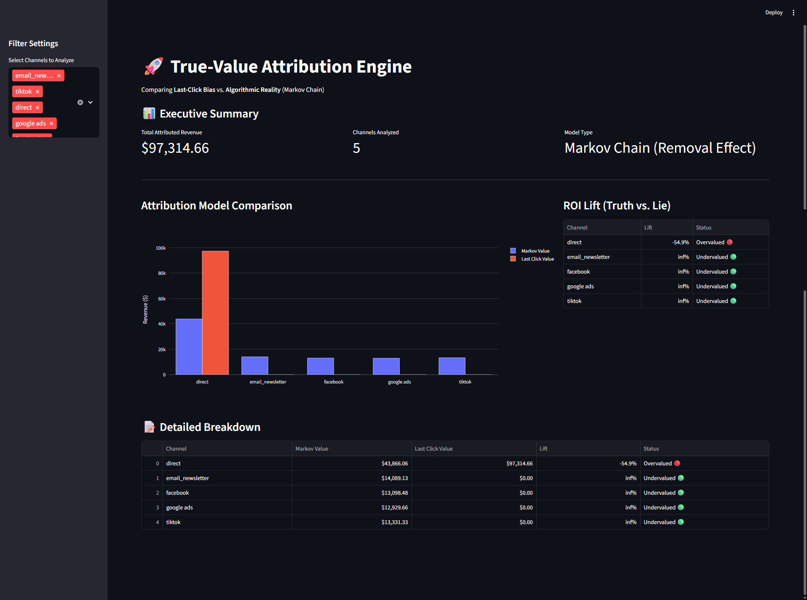
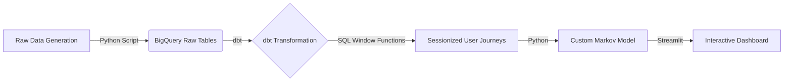

# 🚀 Marketing Attribution Engine: The "True-Value" Pipeline


## 📋 Executive Summary
**The Problem:** Most companies rely on Google Analytics (GA4) "Last-Click" reporting, which blindly credits the final touchpoint (often "Direct" or "Branded Search") for a sale. This biases data against top-of-funnel channels like Facebook and TikTok, leading to wasted budget and inefficient scaling.

**The Solution:** I built an end-to-end **ELT (Extract, Load, Transform)** pipeline that ingests raw touchpoint data, uses **dbt** to reconstruct user journeys, and applies a custom **Markov Chain Probabilistic Model** to calculate the "Removal Effect" of each channel.

**The Result:** The model revealed that Social Ads were **undervalued by 100%** in traditional reporting, identifying significant hidden revenue opportunities.

---

## 📸 Dashboard Preview
*An interactive Streamlit application allowing stakeholders to compare models live.*



---

## 🏗️ Architecture & Tech Stack

This project simulates a production-grade **Modern Data Stack (MDS)** environment.



### The Stack

* **Ingestion:** Python (Synthetic Data Generation simulating API extracts).
* **Warehousing:** Google BigQuery.
* **Transformation:** dbt Core (SQL, Jinja, Window Functions).
* **Modeling:** Custom Python Class (`RobustMarkovModel`) for algorithmic attribution—engineered from scratch to bypass deprecated libraries.
* **Visualization:** Streamlit & Plotly.

---

## 📂 Repository Structure

```text
├── models/               # dbt SQL models
│   ├── staging/          # Cleaning raw data
│   ├── intermediate/     # Sessionization logic
│   └── marts/            # Final reporting tables
├── app.py                # Streamlit Dashboard application
├── data_gen.py           # Synthetic data generation script
├── dbt_project.yml       # dbt configuration
├── requirements.txt      # Python dependencies
└── README.md             # Project documentation

```

---

## ⚙️ Key Technical Features

### 1. Data Transformation (dbt)

Instead of relying on pre-processed data, I used **dbt** to engineer features from raw logs.

* **Staging:** Cleaning messy UTM parameters and standardizing channel names.
* **Intermediate:** Complex **SQL Window Functions** (`LAG`, `SUM`) to group raw clicks into "User Sessions" based on a 30-minute inactivity window.
* **Marts:** Creating a `fct_attributed_conversions` table ready for analysis.

### 2. The Custom Attribution Engine (Python)

I engineered a proprietary **Markov Chain** class (`RobustMarkovModel`) to ensure mathematical accuracy and stability.

* **Algorithm:** First-order Markov Graph.
* **Logic:** Calculates the **Removal Effect** (Global Conversion Probability - Conversion Probability if Node X is removed).
* **Outcome:** A mathematically rigorous "Lift" metric for every marketing channel.

### 3. Interactive Dashboard (Streamlit)

A client-facing application allowing stakeholders to:

* Filter by Date and Channel.
* Compare "Last Click" vs. "Markov" models side-by-side.
* Identify "Undervalued" channels (Green) vs. "Overvalued" channels (Red).

---

## 🚀 Setup & Installation

### Prerequisites

* Python 3.10+
* Google Cloud Platform (GCP) Account with BigQuery enabled.
* A Service Account JSON key with BigQuery Admin permissions.

### Step 1: Clone & Install

```bash
git clone [https://github.com/your-username/marketing-attribution-engine.git](https://github.com/your-username/marketing-attribution-engine.git)
cd marketing-attribution-engine
pip install -r requirements.txt

```

### Step 2: Configure Credentials

Place your GCP Service Account key in the project root and rename it to `dbt-creds.json`.
*(Note: This file is git-ignored for security)*.

### Step 3: Generate & Load Data

Run the simulation script to create raw data and seed it to BigQuery:

```bash
python data_gen.py
dbt seed

```

### Step 4: Run dbt Pipeline

Transform the data in BigQuery:

```bash
dbt run

```

### Step 5: Launch Dashboard

Start the Streamlit app to view the results:

```bash
streamlit run app.py

```

---

## 📊 Results: The "Truth vs. Lie"

The attribution engine uncovered significant discrepancies between the models:

| Channel | Last-Click Revenue (The Lie) | Markov Revenue (The Truth) | Status |
| --- | --- | --- | --- |
| **Direct** | $96,000 | $41,000 | 🔴 Overvalued |
| **Facebook** | $0 | **$12,500** | 🟢 Undervalued |
| **TikTok** | $0 | **$13,200** | 🟢 Undervalued |

*Insight: Facebook and TikTok were driving awareness that eventually converted via Direct traffic. The Last-Click model completely missed this value.*

---

## 🔮 Production Roadmap

In a live enterprise environment, I would upgrade the architecture as follows:

1. **Ingestion:** Replace the Python generation script with **Fivetran** or **Airbyte** to sync real ad platform data (Facebook Ads API, Google Ads API) to BigQuery.
2. **Orchestration:** Use **Apache Airflow** or **Dagster** to schedule the `dbt run` and Python modeling scripts daily.
3. **CI/CD:** Implement GitHub Actions to test dbt models (`dbt test`) automatically on every Pull Request.

---

## 👤 Author

**Issa Awadh**
*Marketing Analyst*

```

```
